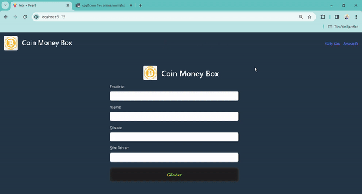

# Bu Projede MVC mimarisi kullanılarak kripto para birimlerinin anlık verilerini alabiliriz.

# Form yapısının kolaylığı için Formik kutuphanesi kullanılmıştır.

# Kütüphaneler:
-Formik

-Yup

-Bootstrap

-chart.js

# In this project, we use MVC architecture to collect instant data of cryptocurrencies.

# we can get it. Formik library was used for ease of form structure.

# Libraries:

-Formik

-Yup

-Bootstrap

-chart.js

